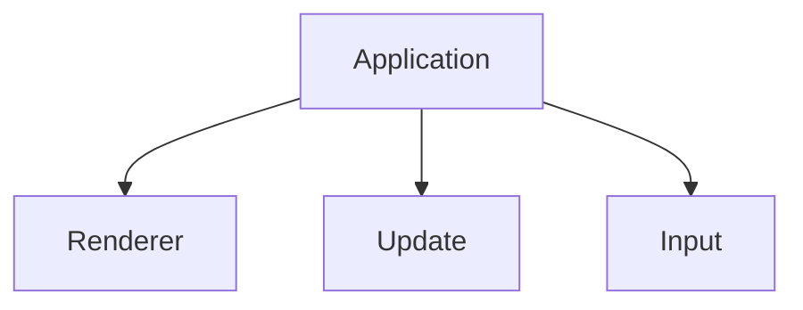

## What is kobolt? 
Kobolt is an open-source game engine backend, meaning that it will just implement the logic and core system/functionality of a game engine. Kobolt will **not have any implemented graphics rendering**, it will instead support rendering to a buffer to be used elsewere.

## Example code (just for testing)
```rust
fn main() {
    println!("Hello World");
}
```

## Structure
_This is an overview of how Kobolt is working_

